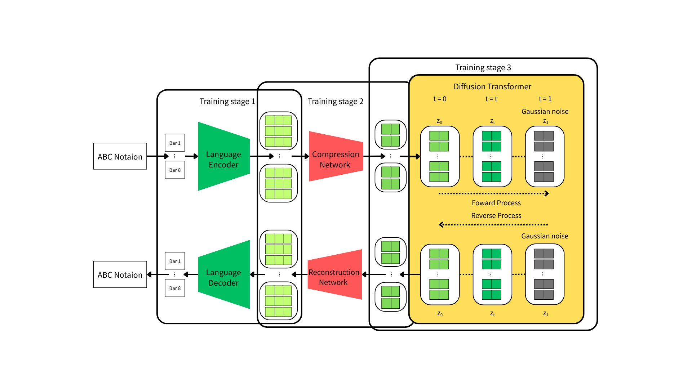

# Latent Language Diffusion Model for Symbolic Melody Generation

This is the official code release for

[**Latent Language Diffusion Model for Symbolic Melody Generation**]

by Hsien-Chen Yeh, Yi-Hsuan Yang



### Abstract
Transformer based models have achieved remarkable results in symbolic melody generation. However, their autoregressive nature limits their effectiveness in tasks like melody inpainting. Conversely, diffusion models, while highly suc-cessful in modeling continuous data like images, audio, and video, have seen limited application in discrete domains like symbolic melody generation. This paper proposes using a Latent Language Diffusion Model for symbolic melody generation, which leverages a language model to encode discrete symbolic music data into a continuous latent space, making it amenable to processing by contin-uous diffusion models. This approach allows us to sample continuous latent rep-resentations including achieving melody continuation and melody inpainting tasks, which can subsequently be decoded back into discrete symbolic music data via the language decoder. Our model was successfully trained using freely available and low-cost resources such as Google Colab (NVIDIA T4 GPU) and Kaggle Kernels (NVIDIA P100 GPU), demonstrating its low computational re-quirements and suitability for resource-constrained settings. Our evaluation demonstrates strong performance in melody continuation tasks, and outperforms autoregressive baselines in melody inpainting task, with a faster inference speed in both tasks.

## Environment
A suitable environment can be created with the following commands. 
```bash
pip install -r requirements.txt
```

## Datasets

The IrishMAN dataset is loaded from the HuggingFace Hub.

## Training

We provide example scripts with our default parameters.
You can pre-train the language model with
```bash
./scripts/autoencoder/train_bart_model.sh
```

You can pre-train the language autoencoder with the language model with
```bash
./scripts/autoencoder/train_bart_latent.sh
```

After this is trained, you can then train a latent diffusion model with
```bash
./scripts/diffusion/train_self_super.sh
```

## Evaluation
To evaluate a trained model on the validation set using Mauve result or Bert score, see the `scripts/diffusion/eval.sh` script for an example. The `--resume_dir` argument should be updated with the path of a trained model. Different sampling configurations can be explored by changing the `{num_samples, sampling_timesteps, sampler, infill, outfill, method}` arguments.  

To evaluate the generated midi files, see `evaluatio/abc_evaluation.py`, `evaluatio/cal_similarity.py` and `evaluatio/cal_dtw.py`.

## Inference time Comparison
To create midi files with a trained model on the validation set, while checking the inference time, see the `scripts/diffusion/inference.sh` script for an example. The `--resume_dir` argument should be updated with the path of a trained model. Different sampling configurations can be explored by changing the `{num_samples, sampling_timesteps, sampler, infill, outfill, method}` arguments.

## Acknowledgement
This work is built upon [Latent Diffusion for Language Generation](https://github.com/justinlovelace/latent-diffusion-for-language) and open-source implementations from [Lucidrains](https://github.com/lucidrains). We modified the transformer implementation to the newest version ([link](https://github.com/lucidrains/x-transformers)), utilizing Rotary Positional Embeddings (RoPE) and Multi‑head Latent Attention (MLA).
